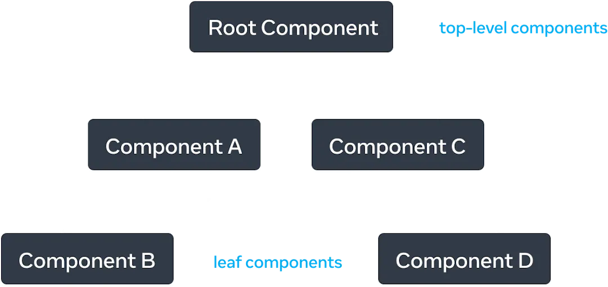
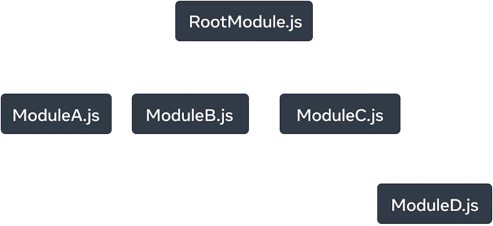

# Create your own React Project

## Get Started

### Install dependency packages

First make sure you have installed Node Package Manager (npm) for Node.js and Node Package Execute (npx), use `npm -v` and `npx -v` to check if you have installed them.

### Create project framework

Then, use the following command to create a React project framework.

```shell
npx create-react-app <appname>
```

In the project folder, use the following command to run.

```shell
npm start
```

After running this command, you can visit your project on `localhost:3000`. (You can see a starter page)

Now you can edit `src/App.js` and save to reload.


## React Intro

React is a JavaScript library for rendering user interfaces (UI).

UI is built from small units like buttons, text, and images.

React lets you combine them into reusable, nestable *components.* 


### React Components

React applications are built from isolated pieces of UI called ***components***. A React component is a JavaScript function that you can sprinkle with markup.

React components are usually written in JavaScript. But use JSX (Java Script XML) to describe UI structures.

```jsx
<div className="App"> ... </div>
```

This is a `div` container that wraps the entire contents of the component. `className="App"` is the CSS class name for the `div` so that it can be styled in a stylesheet.

After using `npx create-react-app <appname>` to create a project framework, the entry point of the application is in **`src/index.js`**.

DOM (Document Object Model): in `.html`.

> [!NOTE]
>
> My understanding: `/public/index.html` defines the "outside" settings of a webpage (like title, icon, ....) , `/src/index.js` is the entry point of the application (rendering is done here). And the `.css` file defines the styles of the CSS classes. In `.js` file, we need to use `className="..."` to define the CSS class name for each component (if you want to give it some style).


### React Props

React components use ***props*** (short for "properties") to communicate with each other. Every parent component can pass some information to its child components by giving them props.


React uses trees to model the relationships between components and modules.

A React render tree is a representation of the parent and child relationship between components.

**React Render Tree**




**Module dependency tree**




## What you have finished 🎇 

https://react.dev/learn/describing-the-ui

